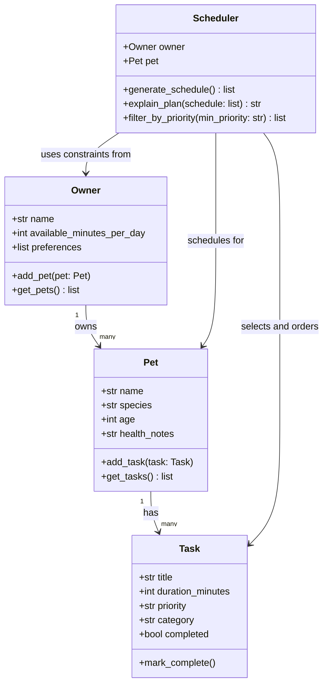

# PawPal+ Project Reflection

## 1. System Design

**Three core user actions:**
1. Add a pet — enter owner + pet info (name, species, age, health notes).
2. Add or edit care tasks — define tasks with a title, duration, priority, and category (walk, feeding, medication, grooming, enrichment).
3. Generate a daily plan — produce a prioritized schedule that fits within the owner's available time and explain why each task was included or skipped.

**UML Diagram (Mermaid.js):**

**a. Initial design**

The initial design has four classes:

- **Task** (dataclass) — holds the data for a single care activity: title, duration, priority, category, and completion status. It does one thing: represent a task and allow marking it done.
- **Pet** (dataclass) — stores pet info (name, species, age, health notes) and maintains its own list of tasks. It acts as the data container that connects a pet to its care needs.
- **Owner** (dataclass) — stores owner info and their constraints: how many minutes per day they have available, plus optional preferences. Owns one or more pets.
- **Scheduler** — the logic class. It takes an Owner and a Pet, then generates a prioritized daily schedule that fits within the owner's time budget. It also explains the plan and can filter tasks by priority.

The key relationship is: Owner → Pet → Task (ownership chain), and Scheduler sits above all three, reading from Owner and Pet to produce the plan.

**b. Design changes**

- Did your design change during implementation?
- If yes, describe at least one change and why you made it.

---

## 2. Scheduling Logic and Tradeoffs

**a. Constraints and priorities**

- What constraints does your scheduler consider (for example: time, priority, preferences)?
- How did you decide which constraints mattered most?

**b. Tradeoffs**

- Describe one tradeoff your scheduler makes.
- Why is that tradeoff reasonable for this scenario?

---

## 3. AI Collaboration

**a. How you used AI**

- How did you use AI tools during this project (for example: design brainstorming, debugging, refactoring)?
- What kinds of prompts or questions were most helpful?

**b. Judgment and verification**

- Describe one moment where you did not accept an AI suggestion as-is.
- How did you evaluate or verify what the AI suggested?

---

## 4. Testing and Verification

**a. What you tested**

- What behaviors did you test?
- Why were these tests important?

**b. Confidence**

- How confident are you that your scheduler works correctly?
- What edge cases would you test next if you had more time?

---

## 5. Reflection

**a. What went well**

- What part of this project are you most satisfied with?

**b. What you would improve**

- If you had another iteration, what would you improve or redesign?

**c. Key takeaway**

- What is one important thing you learned about designing systems or working with AI on this project?
