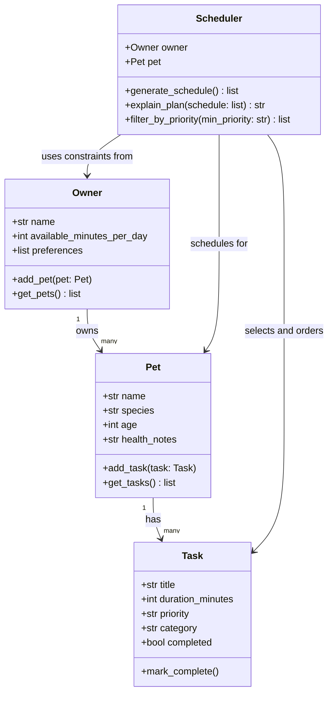

# PawPal+ Project Reflection

## 1. System Design

**Three core user actions:**
1. Add a pet — enter owner + pet info (name, species, age, health notes).
2. Add or edit care tasks — define tasks with a title, duration, priority, and category (walk, feeding, medication, grooming, enrichment).
3. Generate a daily plan — produce a prioritized schedule that fits within the owner's available time and explain why each task was included or skipped.

**UML Diagram (Mermaid.js):**

**a. Initial design**

The initial design has four classes:

- **Task** (dataclass) — holds the data for a single care activity: title, duration, priority, category, and completion status. It does one thing: represent a task and allow marking it done.
- **Pet** (dataclass) — stores pet info (name, species, age, health notes) and maintains its own list of tasks. It acts as the data container that connects a pet to its care needs.
- **Owner** (dataclass) — stores owner info and their constraints: how many minutes per day they have available, plus optional preferences. Owns one or more pets.
- **Scheduler** — the logic class. It takes an Owner and a Pet, then generates a prioritized daily schedule that fits within the owner's time budget. It also explains the plan and can filter tasks by priority.

The key relationship is: Owner → Pet → Task (ownership chain), and Scheduler sits above all three, reading from Owner and Pet to produce the plan.

**b. Design changes**

Yes, the `Scheduler` class changed during implementation. In the original UML skeleton, the constructor took both an `Owner` and a single `Pet` — `Scheduler(owner, pet)`. This meant you would need a separate scheduler instance for every pet, which didn't make sense for an owner managing multiple animals.

During implementation I realized the Scheduler should be responsible for the owner's entire day, not just one pet's tasks. I changed the constructor to `Scheduler(owner)` only, and added a `get_all_tasks()` helper that loops over every pet in `owner.get_pets()` and collects all their tasks into one list. The scheduler then sorts and schedules across that combined task list.

This change made the `explain_plan()` output much more useful too — it can now show which pet each task belongs to, so the owner sees their whole day in one view rather than separate plans per pet.

---

## 2. Scheduling Logic and Tradeoffs

**a. Constraints and priorities**

The scheduler considers two main constraints:

1. **Time budget** — `owner.available_minutes_per_day` is a hard cap. No task is added to the schedule if it would push the total over that limit. This felt like the most important constraint to get right first, because the app is useless if it produces a plan the owner literally cannot complete in a day.

2. **Task priority** — Tasks are ranked high (3) > medium (2) > low (1) and sorted before the greedy selection loop. This means high-priority tasks always get picked before lower ones, even if a low-priority task would technically "fit" in the remaining time first.

I decided priority matters more than time-of-day ordering because an owner should always do the most important things (medication, feeding) before optional ones (grooming, enrichment), regardless of when they happen. Sorting by wall-clock time comes after scheduling, as a display step.

**b. Tradeoffs**

The conflict detection only checks tasks that have a `scheduled_time` set, and it uses exact interval math — two tasks conflict only if their time windows literally overlap. It does not try to resolve conflicts or suggest alternative times; it just warns.

This is a reasonable tradeoff for this use case because most pet care tasks are flexible in practice (you can move a walk 10 minutes without consequence). Returning a warning string rather than blocking the schedule means the owner still sees a usable plan and can decide whether the overlap actually matters. A hard block or auto-rescheduling system would be more complex and could produce worse plans in edge cases where the owner intentionally books overlapping tasks across pets handled by different people.

---

## 3. AI Collaboration

**a. How you used AI**

- How did you use AI tools during this project (for example: design brainstorming, debugging, refactoring)?
- What kinds of prompts or questions were most helpful?

**b. Judgment and verification**

- Describe one moment where you did not accept an AI suggestion as-is.
- How did you evaluate or verify what the AI suggested?

---

## 4. Testing and Verification

**a. What you tested**

- What behaviors did you test?
- Why were these tests important?

**b. Confidence**

- How confident are you that your scheduler works correctly?
- What edge cases would you test next if you had more time?

---

## 5. Reflection

**a. What went well**

- What part of this project are you most satisfied with?

**b. What you would improve**

- If you had another iteration, what would you improve or redesign?

**c. Key takeaway**

- What is one important thing you learned about designing systems or working with AI on this project?
