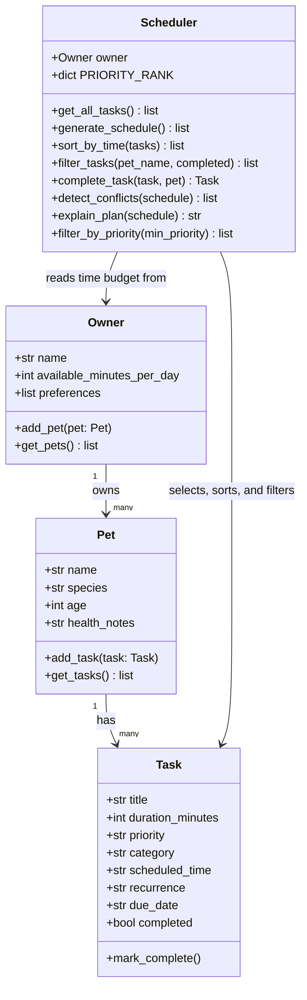

# PawPal+ Project Reflection

## 1. System Design

**Three core user actions:**
1. Add a pet — enter owner + pet info (name, species, age, health notes).
2. Add or edit care tasks — define tasks with a title, duration, priority, category, optional scheduled time, and recurrence.
3. Generate a daily plan — produce a prioritized schedule that fits within the owner's available time, sorted by wall-clock time, with conflict warnings and an explanation of what was skipped.

**Final UML Diagram (Mermaid.js — updated to match actual implementation):**

**a. Initial design**

The initial design has four classes:

- **Task** (dataclass) — holds the data for a single care activity: title, duration, priority, category, and completion status. It does one thing: represent a task and allow marking it done.
- **Pet** (dataclass) — stores pet info (name, species, age, health notes) and maintains its own list of tasks. It acts as the data container that connects a pet to its care needs.
- **Owner** (dataclass) — stores owner info and their constraints: how many minutes per day they have available, plus optional preferences. Owns one or more pets.
- **Scheduler** — the logic class. It takes an Owner and generates a prioritized daily schedule that fits within the owner's time budget. It also explains the plan and can filter tasks by priority.

The key relationship is: Owner → Pet → Task (ownership chain), and Scheduler sits above all three, reading from Owner to collect and schedule tasks.

**b. Design changes**

Two changes happened during implementation:

First, the `Scheduler` constructor changed from `Scheduler(owner, pet)` to `Scheduler(owner)`. The original UML assumed a separate scheduler per pet, but that made it impossible to plan a full day across multiple animals. The fix was to remove the `pet` parameter and add a `get_all_tasks()` method that loops through all the owner's pets at once. This also made `explain_plan()` much more useful — it now shows which pet each task belongs to in a single unified view.

Second, `Task` gained three optional fields during Phase 4: `scheduled_time` (an "HH:MM" string for wall-clock start times), `recurrence` ("daily" or "weekly"), and `due_date` (set automatically when a recurring task regenerates). These were added to support time-based sorting, conflict detection, and the auto-renewal feature. Because they all default to empty strings, no existing code had to change.

---

## 2. Scheduling Logic and Tradeoffs

**a. Constraints and priorities**

The scheduler considers two main constraints:

1. **Time budget** — `owner.available_minutes_per_day` is a hard cap. No task is added to the schedule if it would push the total over that limit. This felt like the most important constraint to get right first, because the app is useless if it produces a plan the owner literally cannot complete in a day.

2. **Task priority** — Tasks are ranked high (3) > medium (2) > low (1) and sorted before the greedy selection loop. This means high-priority tasks always get picked before lower ones, even if a low-priority task would technically "fit" in the remaining time first.

I decided priority matters more than time-of-day ordering because an owner should always do the most important things (medication, feeding) before optional ones (grooming, enrichment), regardless of when they happen. Sorting by wall-clock time is a display step that happens after the schedule is built.

**b. Tradeoffs**

The conflict detection only checks tasks that have a `scheduled_time` set, and it uses exact interval math — two tasks conflict only if their time windows literally overlap. It does not try to resolve conflicts or suggest alternative times; it just warns.

This is a reasonable tradeoff for this use case because most pet care tasks are flexible in practice (you can shift a walk 10 minutes without consequence). Returning a warning string rather than blocking the schedule means the owner still sees a usable plan and can decide whether the overlap actually matters. A hard block or auto-rescheduling system would be more complex and could produce worse plans in edge cases — for example, an owner who has two pets and two helpers could intentionally book overlapping tasks.

---

## 3. AI Collaboration

**a. How you used AI**

AI was used throughout this project in three distinct ways:

- **Design brainstorming (Phase 1)** — I described the PawPal+ scenario and asked for a Mermaid.js class diagram based on the four classes I had in mind. This was the fastest and most useful prompt of the whole project. The diagram gave me a concrete starting point instead of staring at a blank file.

- **Skeleton generation (Phase 1–2)** — I used AI to generate the initial class stubs and then asked it to fill in the method bodies one at a time, explaining what each one should do. Asking for one method at a time produced much cleaner output than asking for the whole file at once.

- **Test generation (Phase 5)** — I asked AI what the most important edge cases were for a scheduler with sorting and recurring tasks, then used that list to write test functions. Some tests I wrote myself from scratch; others I asked AI to draft and then reviewed line by line before keeping them.

The most helpful prompt pattern was something like: *"Here is my current method [paste code]. What edge case is this missing?"* — specific and anchored to real code rather than vague questions.

**b. Judgment and verification**

In Phase 2, when I asked AI how the Scheduler should retrieve tasks from the Owner, the initial suggestion was to keep `Scheduler(owner, pet)` and add a loop inside `generate_schedule()` that iterated over a `pet` parameter. I rejected this because it meant you'd still need a separate `Scheduler` instance per pet, which is exactly the problem I was trying to solve.

I verified my alternative — passing only `owner` and collecting all pets via `get_all_tasks()` — by running `main.py` and confirming that the output showed tasks from both Mochi and Luna in a single plan. I also checked that the `explain_plan()` output correctly labeled each task with the right pet name. Only once both looked right did I commit.

---

## 4. Testing and Verification

**a. What you tested**

The test suite covers seven areas across 21 tests:

- **Task behavior** — `mark_complete()` flips the status flag; new tasks always start incomplete.
- **Pet behavior** — adding tasks increases the count; `get_tasks()` returns a copy so the internal list can't be accidentally mutated from outside.
- **Schedule generation** — the scheduler respects the time budget, skips completed tasks, orders by priority, and returns an empty list when there are no pets or tasks.
- **Sort by time** — tasks added out of order come back in ascending HH:MM order; tasks with no time go last.
- **Filtering** — `filter_tasks()` correctly narrows by pet name and by completion status independently.
- **Recurring tasks** — completing a daily task adds a new task due tomorrow; weekly adds one due in seven days; non-recurring tasks return `None`.
- **Conflict detection** — overlapping windows are flagged; back-to-back tasks (touching but not overlapping) are not; tasks without a scheduled time are completely ignored by conflict detection.

These tests mattered because the scheduling logic has several moving parts that interact — a bug in the priority sort could silently affect the time budget, and a bug in `complete_task` could add duplicate tasks or set the wrong date.

**b. Confidence**

Confidence level: **★★★★☆ (4/5)**

The core backend is thoroughly tested and I'm confident it behaves correctly for all the scenarios I could think of. The gap is the Streamlit UI — session state, form interactions, and what happens when the user edits the owner name mid-session aren't covered by automated tests. That would require end-to-end tooling like Playwright or Streamlit's own test utilities.

The next edge cases I'd test if I had more time:
- An owner with two pets where both have the same task title — does filtering still work correctly?
- A recurring task that is completed multiple times in a row — do duplicates accumulate?
- A task whose `duration_minutes` exactly equals `available_minutes_per_day` — is it included or excluded?

---

## 5. Reflection

**a. What went well**

The separation between the logic layer (`pawpal_system.py`) and the UI (`app.py`) worked really well. Because all the real work happened in plain Python classes, I could test and verify everything in the terminal with `main.py` before touching Streamlit at all. When I did connect the UI in Phase 3, most of it was just wiring — the hard thinking was already done and proven. That CLI-first approach is something I'd use on any future project.

**b. What you would improve**

The scheduler is greedy — it picks tasks in priority order and stops when it runs out of time. This means a 1-minute low-priority task could easily fit in leftover time after all the high-priority tasks, but the scheduler won't try to squeeze it in if a medium-priority task was already rejected. A smarter approach would be to run a second pass over the remaining time budget and fill gaps with smaller tasks. I'd also add a proper `scheduled_time` validator in the UI instead of the basic length check I'm using now.

**c. Key takeaway**

The most important thing I learned is that AI is a very fast first-draft generator but a poor final-draft author. Every time I asked for a full method or a full class, the output was close but never quite right — it would miss a relationship, use the wrong variable name, or solve a slightly different problem than the one I described. The workflow that actually worked was: I decided the design, AI wrote the first draft, I read every line, I changed what was wrong, I ran the tests. AI saved a lot of time, but the decisions were always mine. That's what "lead architect" actually means in practice.
